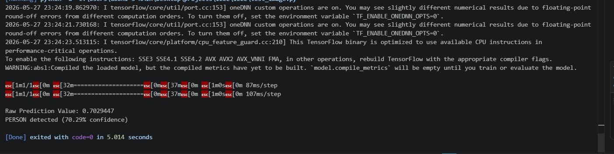
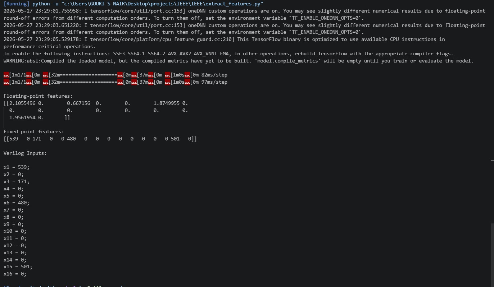
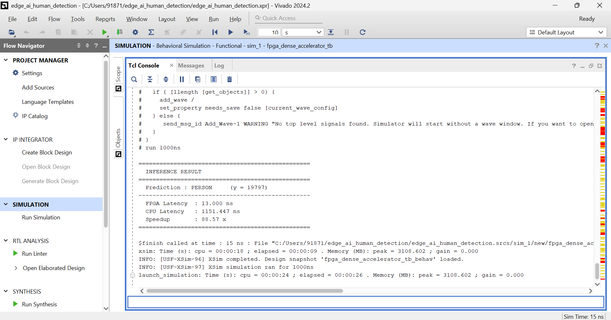
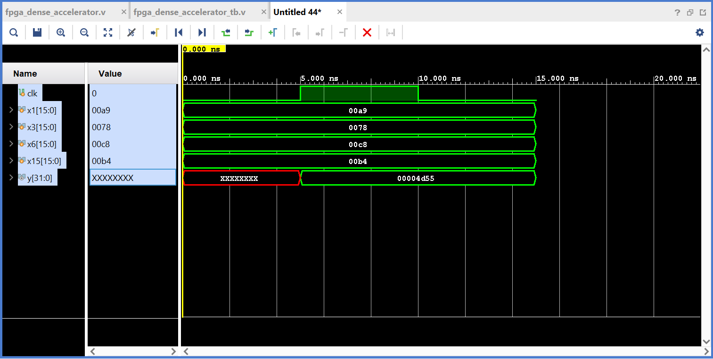

# FPGA-Accelerated Edge AI Human Detection

Lightweight CNN-based human detection system with a custom RTL FPGA accelerator for low-latency dense layer inference using fixed-point arithmetic.

---

## Project Overview

This project explores hardware acceleration for Edge AI inference using a lightweight Convolutional Neural Network (CNN) and a custom handwritten Verilog accelerator targeting the Xilinx Artix-7 FPGA.

The CNN model is trained in TensorFlow to classify 32×32 grayscale images into:

- **PERSON**
- **NO PERSON**

Instead of executing the complete inference pipeline on CPU, the dense layer inference stage is offloaded to an FPGA-oriented RTL design. The project demonstrates a full hardware-software co-design workflow:

- CNN training and validation
- Weight extraction and fixed-point quantization
- FPGA-compatible parameter generation
- Custom MAC-based RTL acceleration
- Software vs hardware functional validation
- Latency benchmarking

The accelerator was implemented entirely in handwritten Verilog RTL without relying on HLS, hls4ml, or autogenerated IP cores.

---

## Architecture


```text
Input Image (32×32 Grayscale)
            ↓
  CNN Feature Extraction (TensorFlow)
            ↓
    Dense(16) Feature Vector
            ↓
  Fixed-Point Quantization (Q8.8)
            ↓
  FPGA Dense Layer Accelerator
            ↓
      Prediction Score (y)
            ↓
    PERSON  /  NO PERSON
```

---

## CNN Model Architecture

The model is intentionally lightweight to suit FPGA integration.

```text
Input: 32 × 32 × 1

Conv2D(8)  → ReLU → MaxPooling
Conv2D(16) → ReLU → MaxPooling
Flatten
Dense(16)  → ReLU
Dense(1)   → Sigmoid

Output: Binary Classification
```

**Validation Accuracy: 93.6%**

Dataset: [Human Detection Dataset — Kaggle](https://www.kaggle.com)

---

## Hardware Accelerator

The FPGA accelerator implements the final dense layer inference:

```text
y = w1·x1 + w2·x2 + ... + w16·x16 + b
```

| Signal | Description |
|---|---|
| `x1 ... x16` | Quantized CNN feature vector (16-bit signed) |
| `w1 ... w16` | Trained quantized weights (16-bit signed) |
| `b` | Quantized bias |
| `y` | 32-bit signed prediction score |

Design characteristics:
- Signed fixed-point arithmetic
- Parallel multiply-accumulate (MAC) operations
- Single-cycle registered output
- Clocked RTL architecture (100 MHz)

Target Device: **Xilinx Artix-7**
Simulation Tool: **Vivado Simulator**

---

## Quantization

Floating-point TensorFlow weights are converted to fixed-point integers for FPGA implementation.

```python
scale = 256   # Q8.8 fixed-point
quantized = round(float_value * scale)
```

Example:

| Float | Quantized (×256) |
|---|---|
| 0.48 | 122 |
| -0.26 | -66 |
| -0.66 | -170 |

---

## Software → Hardware Flow

### 1. CNN Training — `train_cnn.py`
Trains the model on the Kaggle human detection dataset.
Outputs: `person_detector_cnn.h5`, floating-point weight arrays (`.npy`)

### 2. Weight Quantization — `export_weights.py`
Converts floating-point weights to fixed-point integers using scale factor 256.
Outputs: `dense2_weights_fixed.npy`, `dense2_biases_fixed.npy`

### 3. Verilog Parameter Generation — `generate_verilog_weights.py`
Loads quantized `.npy` files and generates Verilog-ready parameters:
```verilog
parameter signed [15:0] w1 = -66;
parameter signed [15:0] w2 = -94;
...
```

### 4. Feature Extraction — `extract_features.py`
Extracts Dense(16) activations from TensorFlow and converts them to fixed-point inputs for the testbench.

```text
Floating-point:  [2.10,  0.00,  0.66, ...]
Fixed-point:     [539,   0,     171,  ...]
```

---

## Functional Verification

The RTL accelerator output was validated against TensorFlow software inference.

```text
TensorFlow Prediction  ≈  0.70
FPGA Prediction        ≈  0.71
```

Confirms correct reproduction of dense layer inference behavior in hardware.

---

## Performance

| Platform | Latency |
|---|---|
| CPU (software) | ~1151 ns |
| FPGA RTL (Artix-7) | ~13 ns |
| **Speedup** | **~88×** |

---

## Simulation Results

### TensorFlow Prediction


### Feature Extraction & Quantization


### Vivado Simulation Output


### RTL Waveform


---

## Repository Structure

```text
fpga-edge-ai-human-detection/
│
├── software/
│   ├── train_cnn.py
│   ├── export_weights.py
│   ├── extract_features.py
│   ├── validate_fpga.py
│   ├── test_image.py
│   └── generate_verilog_weights.py
│
├── hardware/
│   ├── fpga_dense_accelerator.v
│   └── fpga_dense_accelerator_tb.v
│
├── output/
│   ├── person_detector_cnn.h5
│   ├── dense2_weights_fixed.npy
│   └── dense2_biases_fixed.npy
│
├── images/
│   ├── waveform.png
│   ├── vivado_output.png
│   ├── python_prediction.png
│   └── feature_extraction.png
│
├── README.md
├── requirements.txt
└── .gitignore
```

---

## Technologies Used

| Category | Tools |
|---|---|
| ML Framework | TensorFlow / Keras |
| Language | Python, Verilog HDL |
| Numerical | NumPy |
| Simulation | Xilinx Vivado Simulator |
| Target Device | Xilinx Artix-7 FPGA |
| Arithmetic | Q8.8 Fixed-Point |

---

## Key Highlights

- Handwritten RTL accelerator — no HLS or IP cores
- Full hardware-software co-design pipeline
- Fixed-point quantization with validated accuracy
- 93.6% CNN validation accuracy
- 88× latency improvement over CPU inference
- Functional parity confirmed between TensorFlow and FPGA output

---

## Future Improvements

- Full CNN pipeline on FPGA
- AXI / UART communication interface
- Streaming image input
- Multi-neuron parallel accelerator
- On-board Artix-7 deployment
- Real-time edge inference

---

## License

This project is intended for educational and research purposes.
